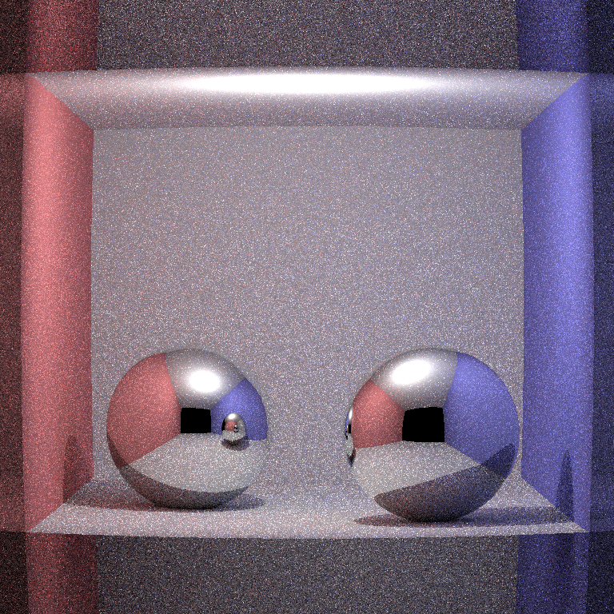

This is my first attempt at working with rust.

So I'm writing a ray tracer, as usual.

Right now, the thing I like with rust are:

- I don't know what I'm doing at all. But I'm following the compiler. I've put
  lifetime annotation without any idea about what I'm doing. I've put Copy /
  Clone / PartialEq traits without any idea either. I do suspect that there may
  be some ugly copy happening in the background...

The things which annoys me, or that I don't understand:

- Who had the idea that Foo::new is a good idea? I'm a C++ developer, so I want to write new Foo. (But there may be a semantic I don't understand yet).
- No polymorphic numbers! It sucks so much to have to write "0." when I want a 0.
- No repl?


## How the hell does it work

```
cargo build && ./target/debug/rust_rt && eog output.ppm
```

Should display something ugly such as:



That's raytracing of sphere, with lighting, but no shadow, and everything is crappy.
